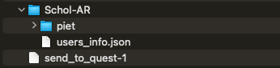
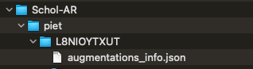

# Command: scholar

[Schol-AR](https://www.schol-ar.io/) is a website and associated software that allows users to create augmented reality overlays for their publication images. Users can create a Schol-AR account free of charge and upload 3D models from ChimeraX, which can then be linked to figures in a publication for viewing the associated 3D augmentations with a smartphone or web-based PDF viewer. Schol-AR is described in:

> [Integrating data directly into publications with augmented reality and web-based technologies – Schol-AR.](https://www.nature.com/articles/s41597-022-01426-y)  
> Ard T, Bienkowski MS, Liew S, Sepehrband F, Yan L, Toga AW.  
> *Sci Data* **9**(1):298 (2022).

See also: [Schol-AR YouTube videos](https://www.youtube.com/@schol-ar7559%20target=")

The **scholar** command interfaces with the [Schol-AR website](https://www.schol-ar.io/) to allow:

- creating a user account
- for a user, creating one or more **_projects_**, each corresponding to a single publication, poster, or presentation
- within a project, creating one or more **_augmentations_**, each consisting of a 3D model to show in augmented reality and the corresponding target image that appears in the project (_e.g._, a figure in the paper)
- generating QR codes for each project:
  - a permanent, public QR code that should be included in the publication, poster, or presentation so that viewers can access the associated Schol-AR augmentations
  - a private QR code that acts like a password to edit the project; it should be kept private and is not guaranteed to be permanent

Deleting projects and augmentations, however, can only be done at the [Schol-AR website](https://www.schol-ar.io/).

The most common approach will be to use the [ScholAR](https://www.cgl.ucsf.edu/home/meng/chimerax/vdocs/user/tools/scholar.html) graphical interface. However, its functions are implemented as several **scholar** subcommands:

- [**scholar login**](#scholar-login-local-username-api-token)
- [**scholar project**](#scholar-project-local-username-project-title-projecttype-paper--poster--book--other-discurl-project-url)
- [**scholar augmentation**](#scholar-augmentation-local-username-project-title-augmentation-title-augmentationtype-model)
- [**scholar downloadQR**](#scholar-downloadqr-local-username-project-title)
- [**scholar downloadAugFiles**](#scholar-downloadaugfiles-local-username-project-title-augmentation-title-targetimage-true--false-augmentedfile-true--false)
- [**scholar uploadAugFiles**](#scholar-uploadaugfiles-local-username-project-title-augmentation-title-targetimage-true--false-augmentedfile-true--false)
- [**scholar saveAugSession**](#scholar-saveaugsession-local-username-project-title-augmentation-title-filepath-existing-session-file)
- [**scholar openAugSession**](#scholar-openaugsession-local-username-project-title-augmentation-title)
- [**scholar storeTargetImage**](#scholar-storetargetimage-local-username-project-title-augmentation-title-pathname)
- [**scholar storeModel**](#scholar-storemodel-local-username-project-title-augmentation-title-pathname)
- [**scholar storeQRImage**](#scholar-storeqrimage-local-username-project-title-pathname)
- [**scholar storeAllAugFiles**](#scholar-storeallaugfiles-local-username-project-title-augmentation-title-existing-directory)
- [**scholar cleanLocal**](#scholar-cleanlocal-username-local-username)
- [**scholar removeUser**](#scholar-removeuser-local-username)

## scholar login _local-username_ [_API-token_]

Log in to the associated Schol-AR account and set up local files as needed. Users who have obtained an API token as described [above](https://www.cgl.ucsf.edu/home/meng/chimerax/vdocs/user/commands/scholar.html#account) but not yet created a local username must supply both a _local-username_ and the obtained API token.

The **_local username_** is used by ChimeraX as a convenient alias to the API token and does not need to be the same as the username at the [Schol-AR website](https://www.schol-ar.io/). However:

> The local username and any other user-supplied strings in **scholar** commands must not contain any characters other than letters, numbers, and spaces.
> 
> Note also that strings containing spaces should be enclosed in quotation marks.

Users who have already created a local username and linked it to their API token can simply give that local username to log in.

Technical details: Creating a new local username creates a directory inside of app_dirs_unversioned called Schol-AR if it does not already exist. Inside the Schol-AR folder, a user_info.json file that stores all usernames and API tokens for one Chimerax installation will be created/updated, and a folder titled with the username will be created. Inside the username-titled folder, projects_info.json is created/updated to store data for all of the projects of that user.

## scholar project _local-username_ _project-title_ [_projectType_ paper | poster | book | other] [_discUrl_ _project-URL_]

Create a new project by giving a new _project-title_ or choose an existing project by giving a _project-title_ that was created earlier. Specifying the project type and supplying an URL to be associated with the project, such as a link to a publication or institute, are optional.

Technical details: Creating a new project updates the projects_info.json in the user folder, and a folder inside of the username folder will be created and titled with the project’s 10-character identifier string. Inside that folder, an augmentations_info.json file is created to hold data for all of the project's augmentations. If an existing project is specified, augmentations_info.json will be updated as needed to synchronize with the project status at the [Schol-AR website](https://www.schol-ar.io/).

## scholar augmentation _local-username_ _project-title_ _augmentation-title_ [_augmentationType_ **model**]

Create a new augmentation by giving a new _augmentation-title_ or choose an existing augmentation by giving an _augmentation-title_ that was created earlier. The project must already exist. Currently only one type of augmentation can be created via ChimeraX (3D model in GLB format), so **augmentationType** does not need to be given.

Technical details: Creating a new augmentation automatically runs [**scholar uploadAugFiles**](https://www.cgl.ucsf.edu/home/meng/chimerax/vdocs/user/commands/scholar.html#uploadAugFiles) to upload the associated files and information to the [Schol-AR website](https://www.schol-ar.io/). Locally, the project augmentation_info.json file is updated, and a folder named with the 4-character augmentation ID is created. In turn, it contains three more folders: augmented_file (for the 3D model GLB file), cxs (for an associated [ChimeraX session file](https://www.cgl.ucsf.edu/home/meng/chimerax/vdocs/user/commands/save.html#session), see [**scholar saveAugSession**](https://www.cgl.ucsf.edu/home/meng/chimerax/vdocs/user/commands/scholar.html#saveAugSession)), and target_image (for the target image PNG file). Finally, [**scholar saveAugSession**](https://www.cgl.ucsf.edu/home/meng/chimerax/vdocs/user/commands/scholar.html#saveAugSession) is automatically run to save the current ChimeraX session to the cxs folder. A current limitation is that the GLB file size cannot exceed 30MB. Specifying an existing augmentation will update local files if/as needed to synchronize with the [Schol-AR website](https://www.schol-ar.io/).

## scholar downloadQR _local-username_ _project-title_

Download the project QR files from the [Schol-AR website](https://www.schol-ar.io/) to the local directory structure, within Schol-AR/username/project_id/qr and then /admin or /pub for the private and public QR code images, respectively. This is done so that the QR codes can be displayed by the [ScholAR](https://www.cgl.ucsf.edu/home/meng/chimerax/vdocs/user/tools/scholar.html) graphical interface.

## scholar downloadAugFiles _local-username_ _project-title_ _augmentation-title_ [_targetImage_ **true** | false] [_augmentedFile_ true | **false**]

Download augmentation files from the [Schol-AR website](https://www.schol-ar.io/) to the local directory structure, either the target image (default **true**), or the 3D model (default **false**, do not download), or both.

## scholar uploadAugFiles _local-username_ _project-title_ _augmentation-title_ [_targetImage_ true | **false**] [_augmentedFile_ **true** | false]

Upload augmentation files from the local directory structure (such as after modifications in ChimeraX) to the [Schol-AR website](https://www.schol-ar.io/), either the target image (default **false**, do not upload), or the 3D model (default **true**), or both. A current limitation is that the 3D model file size cannot exceed 30MB.

> The target image must match that in the media seen by the viewers (_e.g._, the corresponding publication figure), so it is very important not to accidentally update/overwrite it when the appearance in ChimeraX is different. There is no way to recover the previous target image with the ChimeraX [ScholAR](https://www.cgl.ucsf.edu/home/meng/chimerax/vdocs/user/tools/scholar.html) tool, **scholar** command, or at the [Schol-AR website](https://www.schol-ar.io/). If the target image no longer matches the published image, others will no longer be able to view the associated augmentation.

## scholar saveAugSession _local-username_ _project-title_ _augmentation-title_ [_filePath_ _existing-session-file_]

Save a [ChimeraX session file](https://www.cgl.ucsf.edu/home/meng/chimerax/vdocs/user/commands/save.html#session) in the augmentation's /cxs folder, either generated from the current state of ChimeraX (default) or by copying an existing session file specified with the **filePath** option, where _existing-session-file_ is the desired pathname (directory location and filename) or the word [**browse**](https://www.cgl.ucsf.edu/home/meng/chimerax/vdocs/user/commands/usageconventions.html#browse) to specify it interactively in a file browser window.

## scholar openAugSession _local-username_ _project-title_ _augmentation-title_

Open the [ChimeraX session file](https://www.cgl.ucsf.edu/home/meng/chimerax/vdocs/user/commands/save.html#session), if any, found in the augmentation's /cxs folder.

## scholar storeTargetImage _local-username_ _project-title_ _augmentation-title_ _pathname_

Save a copy of the augmentation's target image PNG file to a location specified by the user, where _pathname_ is the desired pathname (directory location and filename) or the word [**browse**](https://www.cgl.ucsf.edu/home/meng/chimerax/vdocs/user/commands/usageconventions.html#browse) to specify it interactively in a file browser window.

## scholar storeModel _local-username_ _project-title_ _augmentation-title_ _pathname_

Save a copy of the augmentation's 3D model GLB file to a location specified by the user, where _pathname_ is the desired pathname (directory location and filename) or the word [**browse**](https://www.cgl.ucsf.edu/home/meng/chimerax/vdocs/user/commands/usageconventions.html#browse) to specify it interactively in a file browser window.

## scholar storeQRImage _local-username_ _project-title_ _pathname_

Save a copy of the project's public QR code image file to a location specified by the user, where _pathname_ is the desired pathname (directory location and filename) or the word [**browse**](https://www.cgl.ucsf.edu/home/meng/chimerax/vdocs/user/commands/usageconventions.html#browse) to specify it interactively in a file browser window.

## scholar storeAllAugFiles _local-username_ _project-title_ _augmentation-title_ _existing-directory_

Save copies of the augmentation's target image PNG file and 3D model GLB file as well as the project's public QR code image file to an existing directory (folder) specified by the user.

## scholar cleanLocal [_username_ _local-username_]

Remove all local files corresponding to augmentations and projects that have been deleted by the users at the [Schol-AR website](https://www.schol-ar.io/). Currently, such deletions should be initiated at the website; deleting files locally does not change what is in the website account. Specifying a username argument will remove all local files associated only with that username.

## scholar removeUser _local-username_

Remove a ChimeraX Schol-AR user and all related ChimeraX stored data. This action cannot be undone.

---

UCSF Resource for Biocomputing, Visualization, and Informatics / October 2024